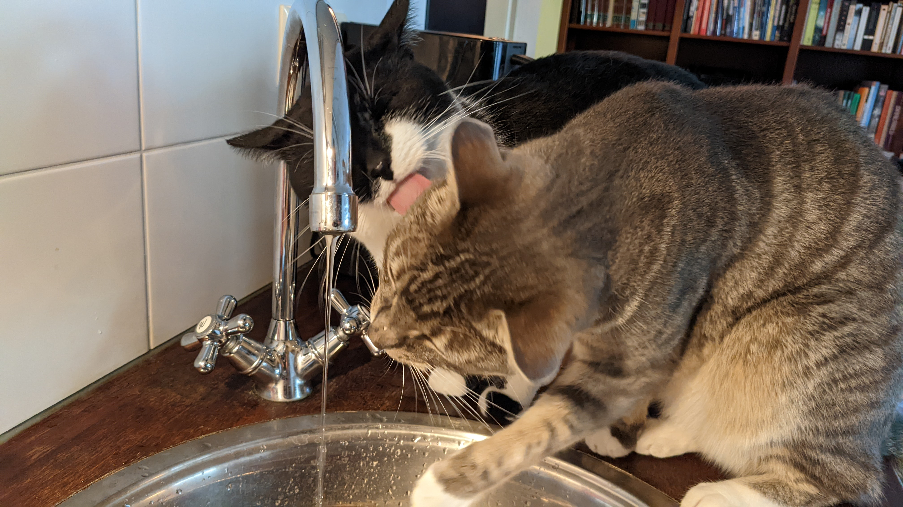

# PETS CARE

## Cats care

### Feeding
- Cats will be feeded by the robot from 21:00 - 6:00. The robot contains food that both cats digest well. 
- During the day it's okay to pick your own moments for feeding as long as it will be more or less always at the same time so the cats can expect when to be feeded.
- Feeding portions are about 20 dry pellets per feeding for each cat. Both cats have there own jar of dry pellets. 
- Once a day Balou needs about 6cm anti-hairball paste. Just put it on top of the pellets, no need to mix. Cats love the taste so once in a while it's okay to give Momo some as well. 
- Once every few days or so you may replace one meal with halve a pouch of soft food (both cats can eat from the same pouch).
- Water should be available abundantly because the food consists mainly of dry pellets. Usually I leave a small pan filled with water downstairs in the kitchen on the ground floor.

### Living space
- Cats may use all rooms from the ground floor to the top floor. Some obstacles must be placed between the door frames and the doors because Balou will close the doors shut without knowing how to open it, only for Momo to be able to set him free...
- Cats use the side balcony but not the terrace on the sleeping floor.

